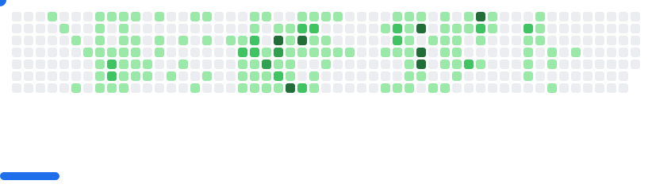

<h1 align="center">
    
</h1>

<h3 align="center">A Aspiring Web developer from Bangladesh   </h3> 

 
 

 
 
 🔭 I’m currently working on **Tech4Realty**
 
 🌱 I’m currently learning **Full Stack Web Development**

 

 

 
  
  
  <a href="https://alvee.sagafootwear.com/" target="_blank">
      <!-- sqlite, safari, google-chrome are other good icon options -->
  </a>

 

 
<h2 align="center">⚒️ Languages-Frameworks-Tools ⚒️</h2>
 

    
     

 

   
  <h2>🐍 My Contributions 🐍</h2>
   
    
 <picture>
  <source
    media="(prefers-color-scheme: dark)"
    srcset="images/breakout-dark.svg"
  />
  <source
    media="(prefers-color-scheme: light)"
    srcset="images/breakout-light.svg"
  />
  
</picture>
 
  
     

<h2 align="center">⚡ Stats ⚡</h2>
 

  

  
  
   
  

  

 
 

  

 

 
