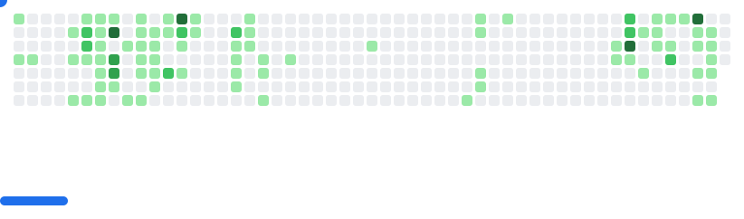

<h1 align="center">
    
</h1>
<h3 align="center">A Web Developer from Bangladesh</h3> 
 
 

 
 
 🎓 I completed my graduation in **January 2026**

 💼 I interned at **Simec System Limited**

 🚀 Currently working as a **Web Developer** at **Shordindu**

 🌱 I'm currently learning **Full Stack Web Development**
 

 

 
  
  
  <a href="https://alvee.sagafootwear.com/" target="_blank">
      <!-- sqlite, safari, google-chrome are other good icon options -->
  </a>

 

<h2 align="center">💡 Expert In 💡</h2>
 

  Django &nbsp;|&nbsp; React &nbsp;|&nbsp; Next.js &nbsp;|&nbsp; PostgreSQL &nbsp;|&nbsp; WordPress &nbsp;|&nbsp; JavaScript &nbsp;|&nbsp; HTML &nbsp;|&nbsp; CSS &nbsp;|&nbsp; Figma &nbsp;|&nbsp; Adobe XD

 

 
<h2 align="center">⚒️ Languages-Frameworks-Tools ⚒️</h2>
 

    
     

 

   
  <h2>🐍 My Contributions 🐍</h2>
   
    
 <picture>
  <source
    media="(prefers-color-scheme: dark)"
    srcset="images/breakout-dark.svg"
  />
  <source
    media="(prefers-color-scheme: light)"
    srcset="images/breakout-light.svg"
  />
  
</picture>
 
  
     

<h2 align="center">⚡ Stats ⚡</h2>
 

  
  

    

  

    

  

    

  

   

> ⚠️ These widgets run on free Vercel deployments and sometimes fail to fetch due to rate limits — if an image shows broken, just refresh the page after a bit, or consider [self-hosting](https://github.com/anuraghazra/github-readme-stats#deploy-on-your-own) your own instance for reliability.
  

 
 

  

 
 
